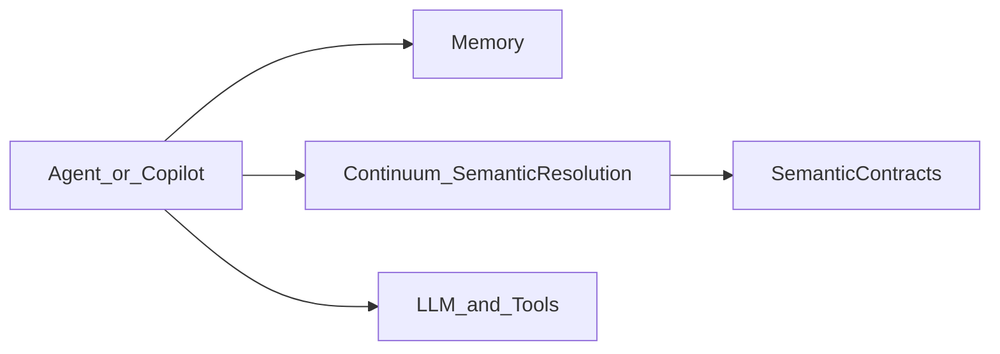

<p align="center">
  <a href="https://getcontinuum.ai">
    
  </a>
</p>

<h1 align="center">Continuum</h1>

<p align="center">
  <b>Continuity for AI that can’t afford to be wrong</b><br/>
  Shared semantic state for AI agents, copilots, and workflows.
</p>

<p align="center">
  <a href="https://docs.getcontinuum.ai"><b>Learn more</b></a> •
  <a href="https://docs.getcontinuum.ai/quickstart"><b>Quickstart</b></a> •
  <a href="https://getcontinuum.ai/demo"><b>Demo</b></a> •
  <a href="https://github.com/get-continuum/continuum-core"><b>Continuum Core</b></a>
</p>

<p align="center">
  <a href="https://github.com/get-continuum/continuum/actions/workflows/ci.yml">
    
  </a>
  <a href="https://app.netlify.com/projects/startling-twilight-f1d12a/deploys">
    
  </a>
  <a href="https://www.npmjs.com/package/@get-continuum/sdk">
    
  </a>
  <a href="https://pypi.org/project/continuum-local/">
    
  </a>
  
  
</p>

<p align="center">
  <i>Memory helps agents remember. Continuum helps agents be correct.</i>
</p>

<hr/>

Continuum helps agents, copilots, and workflows agree on what things mean — across users, tools, and time.

AI systems don’t fail because they forget.  
They fail because they disagree on meaning.

Continuum resolves meaning before execution, so agents stay correct.

## Why Continuum?

Most AI stacks rely on:

- prompts to encode meaning
- RAG to retrieve context
- memory to recall history

None of these decide **which definition is correct** when ambiguity exists.

Continuum introduces a missing primitive:

**Semantic resolution — shared, stable meaning for AI agents.**

## What Continuum does

- Resolves ambiguous terms like revenue, bookings, users
- Anchors meaning to stable semantic IDs
- Returns grounded semantic contracts, not guesses
- Keeps multiple agents aligned over time
- Works across chat, analytics, and workflows

## What Continuum is not

- **Not RAG** (it doesn’t retrieve text)
- **Not chat memory** (it doesn’t store conversations)
- **Not a semantic layer replacement**
- **Not an agent framework**

Continuum is a semantic state layer.

## Quickstart (Hosted API via TS SDK)

Install:

```bash
npm install @get-continuum/sdk
```

Resolve meaning in a few lines of code (hosted Continuum Core API):

```ts
import { Continuum } from "@get-continuum/sdk";

const continuum = new Continuum({
  apiKey: process.env.CONTINUUM_API_KEY,
});

const contract = await continuum.resolve({
  query: "What is revenue?",
  context: { team: "finance" },
});

// SemanticContract (contract-first view)
console.log({
  id: contract.resolved_metric?.metric_id,
  definition: contract.resolved_metric?.description,
  confidence: contract.confidence,
  reason: contract.reason,
});
```

If you’re self-hosting Continuum Core, set `baseUrl`:

```ts
const continuum = new Continuum({ baseUrl: "http://localhost:8000", apiKey: process.env.CONTINUUM_API_KEY });
```

### The “aha” output

Here’s what a resolved **SemanticContract** looks like:

```json
{
  "id": "revenue",
  "definition": "Net revenue excluding refunds",
  "source": "continuum_core",
  "version": "v12",
  "confidence": 0.92,
  "reason": "Context team 'finance' matches candidate domain."
}
```

Notes:

- `id`, `definition`, `confidence`, and `reason` are available today via the response fields shown above.
- `source` + `version` are typically hosted-only metadata (and may vary by deployment).

### What you get back (field map)

- `contract.resolved_metric.metric_id` → `SemanticContract.id`
- `contract.resolved_metric.description` → `SemanticContract.definition`
- `contract.confidence` → `SemanticContract.confidence`
- `contract.reason` → `SemanticContract.reason`

Continuum returns semantic **contracts**, not free-text answers.

## Hosted vs Local

- **Hosted Continuum (recommended for production)**\n  - Resolution API (multi-tenant), versioned meaning, auditability\n  - Accessed via **API key** (TS SDK)\n- **Local Continuum (dev-mode)**\n  - Deterministic resolver for demos/tests\n  - Uses a small `semantics.yaml` file as your “source of truth” (Python package)\n+
## Local usage (Python, no backend required)

Continuum includes a local resolver for development and testing.

What `semantics.yaml` contains (minimal example):

```yaml
metrics:
  - metric_id: revenue
    canonical_name: Revenue
    description: Net revenue excluding refunds
    tags: [finance]
```

Install:

```bash
pip install continuum-local
```

Run the CLI:

```bash
continuum-local resolve --semantics examples/_shared/semantics.yaml --query "revenue" --context '{"team":"finance"}'
```

Or use it as a library:

```python
from continuum_local import load_semantics, resolve, to_semantic_contract

doc = load_semantics("examples/_shared/semantics.yaml")
out = resolve(doc, query="revenue", context={"team": "finance"})

if out.get("status") == "resolved":
    contract = to_semantic_contract(out, context={"team": "finance"})
    print(contract)
```

This lets you:

- try Continuum in minutes
- run examples locally
- understand the API surface
- contribute without infra access

## Examples

See `examples/` for:

- `examples/slack_copilot`: Slack copilot-style loop (local)
- `examples/agent_workflow`: multi-step “agent” loop (local)

## How it fits in the AI stack



Memory remembers context.  
Continuum decides meaning.

## Open source vs core

This repository contains:

- SDKs
- semantic contract types
- local resolver
- examples

The Continuum core engine (semantic graph, versioning, drift detection, multi-tenant infra) lives in a separate repository and is source-available.

This repo is the on-ramp, not the engine.

## Roadmap

- Python hosted SDK (v1.1)
- CLI (`continuum resolve \"…\"`)
- More connectors and examples (LangChain, CrewAI, Slack, analytics)

## Releases & packages

- npm: `@get-continuum/sdk` (TypeScript SDK)
- PyPI: `continuum-local` (Python local resolver)

If these are not published yet, they will be released as `v0.1.0` as soon as the registries are configured.

## Contributing

Issues and PRs welcome.

Good first contributions:

- examples
- local resolver improvements
- SDK ergonomics
- docs

## License

Apache 2.0 (OSS components).

## Learn more

- **Website**: `https://getcontinuum.ai`
- **Docs**: `https://docs.getcontinuum.ai`
- **Core engine**: `https://github.com/get-continuum/continuum-core`

## Support / questions

- Open an issue: `https://github.com/get-continuum/continuum/issues`
