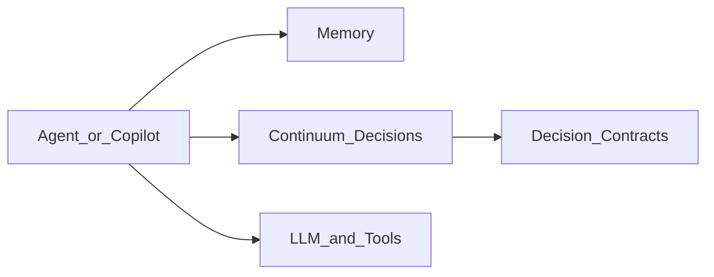

<p align="center">
  <a href="https://getcontinuum.ai">
    
  </a>
</p>

<h1 align="center">Continuum</h1>

<p align="center">
  <b>Decision Control Plane for AI Agents</b><br/>
  Capture, enforce, and resolve decisions so AI agents behave consistently across prompts, sessions, and teams.
</p>

<p align="center">
  <a href="https://docs.getcontinuum.ai"><b>Docs</b></a> &bull;
  <a href="https://docs.getcontinuum.ai/for-code/quickstart"><b>Quickstart</b></a> &bull;
  <a href="https://getcontinuum.ai/demo"><b>Demo</b></a> &bull;
  <a href="https://github.com/get-continuum/continuum-core"><b>Continuum Core</b></a>
</p>

<p align="center">
  <a href="https://github.com/get-continuum/continuum/actions/workflows/ci.yml">
    
  </a>
  <a href="https://pypi.org/project/continuum-sdk/">
    
  </a>
  <a href="https://www.npmjs.com/package/@get-continuum/sdk">
    
  </a>
  
  
</p>

<p align="center">
  <i>Memory helps agents remember. Continuum helps agents be correct.</i>
</p>

<hr/>

## Why Continuum?

AI systems don't fail because they forget. They fail because they **disagree on meaning**.

Most AI stacks rely on prompts, RAG, and memory — but none of these decide **which definition is correct** when ambiguity exists. Continuum introduces the missing primitive:

**Decisions as contracts — shared, stable, enforceable meaning for AI agents.**

## What Continuum does

- **Resolves** ambiguous terms (revenue, production-ready, user) before execution
- **Commits** decisions as typed, versioned contracts with scope and rationale
- **Enforces** decisions deterministically — block, confirm, or allow actions
- **Inspects** active decisions per scope (the "binding set")
- **Supersedes** outdated decisions while preserving full history

## Repository layout

```
oss/
  contracts/       Decision JSON Schemas, spec, examples
  sdk/python/      Python SDK (continuum-sdk)
  sdk-ts/          TypeScript SDK (@get-continuum/sdk)
  cli/             CLI inspector (typer-based)
  mcp-server/      MCP server exposing decision tools
  capabilities/    A-la-carte module registry + continuum.yaml loader
  integrations/    LangGraph, LlamaIndex adapters
  packs/           Decision templates for code workflows
  examples/        Runnable examples
  docs/            Internal docs
demo/
  api/             FastAPI backend (local + hosted MVP)
  ui/              Next.js frontend (Ambiguity Gate + Decision Inspector)
docs/              Mintlify docs site (concepts, cookbooks, SDK reference)
examples/          Flagship demo
.github/           CI + publish workflows
```

## Quickstart

```bash
pip install continuum-sdk
```

```python
from continuum import ContinuumClient

client = ContinuumClient()

# Commit a decision
decision = client.commit(
    title="Use PostgreSQL for user store",
    scope="repo:acme/backend",
    decision_type="rejection",
    options=[
        {"id": "opt_postgres", "title": "PostgreSQL", "selected": True},
        {"id": "opt_mongo", "title": "MongoDB", "selected": False,
         "rejected_reason": "No ACID"},
    ],
    rationale="Need ACID transactions for billing data.",
)

# Inspect active decisions
bindings = client.inspect("repo:acme/backend")

# Enforce an action
result = client.enforce(
    action={"type": "code_change", "description": "Switch to MongoDB"},
    scope="repo:acme/backend",
)
print(result["verdict"])  # "block"
```

Run the flagship demo:

```bash
python examples/flagship-demo/flagship_demo.py
```

## MCP Server (for Cursor / agents)

```bash
pip install continuum-mcp-server
```

Exposes tools: `continuum_inspect`, `continuum_resolve`, `continuum_enforce`, `continuum_commit`, `continuum_supersede`.

## How it fits in the AI stack



Memory remembers context. Continuum decides meaning.

## Open source vs core

| Layer | License | What ships |
|---|---|---|
| `oss/` (this repo) | Apache-2.0 | Contracts, SDKs, CLI, MCP, integrations, deterministic engine |
| [`continuum-core`](https://github.com/get-continuum/continuum-core) | BSL-1.1 | LLM-backed scoring, intent resolution, advanced policies |

The OSS layer is fully functional on its own. Core adds intelligence. See [BOUNDARY.md](BOUNDARY.md).

## Packages

| Package | Registry | Description |
|---|---|---|
| `continuum-sdk` | [PyPI](https://pypi.org/project/continuum-sdk/) | Python SDK |
| `@get-continuum/sdk` | [npm](https://www.npmjs.com/package/@get-continuum/sdk) | TypeScript SDK |
| `continuum-cli` | [PyPI](https://pypi.org/project/continuum-cli/) | CLI inspector |
| `continuum-mcp-server` | [PyPI](https://pypi.org/project/continuum-mcp-server/) | MCP server |

## Contributing

Issues and PRs welcome. Good first contributions:

- Examples and cookbooks
- SDK ergonomics
- Integration adapters
- Documentation

See [CONTRIBUTING.md](CONTRIBUTING.md).

## License

Apache 2.0 (OSS components). See [LICENSE](LICENSE).

## Learn more

- **Website**: [getcontinuum.ai](https://getcontinuum.ai)
- **Docs**: [docs.getcontinuum.ai](https://docs.getcontinuum.ai)
- **Core engine**: [github.com/get-continuum/continuum-core](https://github.com/get-continuum/continuum-core)
